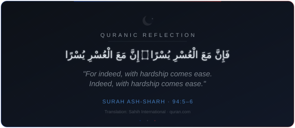

<!-- ========================= -->
<!--        PROFILE BANNER     -->
<!-- ========================= -->

 

<!-- ========================= -->
<!--           TITLE           -->
<!-- ========================= -->

  <ul align="center">
    
<h1 style="display: inline-block">Hi 👋, I'm Ebnul Hasan Mahi</h1>

    <!-- typing animation -->
    
  </ul>

 

<!-- ========================= -->
<!--          ABOUT ME         -->
<!-- ========================= -->

- 👋 Hi, I'm **[@EHMahi9](https://github.com/EHMahi9)** — a software developer who treats every project like a match worth winning.
- 🖥️ I build interactive, high-performance frontend applications using **React.js, Next.js, and TypeScript**.
- ⚙️ I work with **JavaScript, Python, Java, and C** for programming, problem solving, and application logic.
- 🎨 I enjoy crafting **clean interfaces, smooth user experiences, dark-mode designs, and interactive UI animations**.
- 📚 I'm continuously learning and improving through practical projects — the best way to grow is to build.
- 🚀 My long-term vision is to grow as a **Software Developer and Tech Entrepreneur**.
- ⚽ *Més que un club* — code is what I build with, football is what keeps me driven.

 

<!-- ========================= -->
<!--     CURRENTLY BUILDING    -->
<!-- ========================= -->

## 🚀 CURRENTLY BUILDING

<table>
<tr>
<td align="center" width="25%">

**⚛️ Frontend** 
React · Next.js · TypeScript

</td>
<td align="center" width="25%">

**🧠 Problem Solving** 
Algorithms · Fundamentals

</td>
<td align="center" width="25%">

**⚽ Football Tech** 
Analytics · Scouting Ideas

</td>
<td align="center" width="25%">

**💡 Entrepreneurship** 
Building Useful Products

</td>
</tr>
</table>

Exploring: AI · Automation · Modern Web · Football Technology

 

<!-- ========================= -->
<!--      MY PLAYING STYLE     -->
<!-- ========================= -->

## ⚽ MY PLAYING STYLE

<table>
<tr>
<td width="50%">

| Development | Football Analogy |
|:---|:---|
| Frontend | Ball Control |
| TypeScript | Tactical Discipline |
| Problem Solving | Game Reading |
| UI/UX | Creativity |
| Consistency | Stamina |
| Learning | Training |

</td>
<td width="50%" align="center">

`TRAIN → PLAY → ANALYZE → IMPROVE`

 

 

<i>The pitch is my IDE. Every commit is a pass. Ship it like a goal.</i>

</td>
</tr>
</table>

 

<!-- ========================= -->
<!--           SOCIALS         -->
<!-- ========================= -->

## <b> FOLLOW ME ON SOCIALS:</b>

  

    
    
    
  

 

<!-- ========================= -->
<!--         LINKEDIN          -->
<!-- ========================= -->

## 🔗 LINKEDIN

  

 

<!-- ========================= -->
<!--       TECHNOLOGY STACK    -->
<!-- ========================= -->

## <b> TECHNOLOGY STACK:</b>

### 💻 Languages:

### 🎨 Frontend:

### ⚙️ Backend & Runtime:

### 🗄️ Database:

### 🔧 Tools & Technologies:

 

<!-- ========================= -->
<!--      GITHUB STATISTICS    -->
<!-- ========================= -->

## <b> GITHUB STATISTICS & ANALYSIS:</b>

### ⚽ GitHub Contributions:

<picture>
  <source media="(prefers-color-scheme: dark)" srcset="https://raw.githubusercontent.com/EHMahi9/EHMahi9/output/github-contribution-grid-snake-dark.svg" />
  <source media="(prefers-color-scheme: light)" srcset="https://raw.githubusercontent.com/EHMahi9/EHMahi9/output/github-contribution-grid-snake.svg" />
  
</picture>

 

### 📈 GitHub Statistics:

  
  

 

### 🔥 GitHub Streak:

  

 

### 📊 Contribution Stats:

  
  

 

<!-- ========================= -->
<!--     QURANIC REFLECTION    -->
<!-- ========================= -->

## 🌙 QURANIC REFLECTION

 

<!-- ========================= -->
<!--       CAREER PITCH        -->
<!-- ========================= -->

---

<!-- ========================= -->
<!--       PROFILE VIEWS       -->
<!-- ========================= -->

  

### ⚡ Keep Building. Keep Learning. Keep Creating. ⚡

