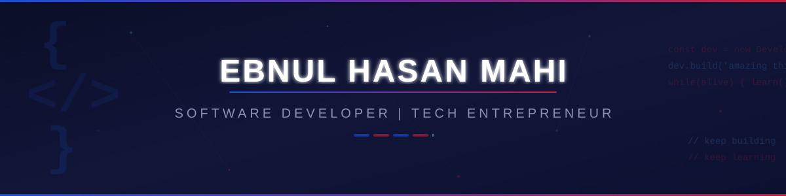

<!-- ========================= -->
<!--        PROFILE BANNER     -->
<!-- ========================= -->

 

<!-- ========================= -->
<!--           TITLE           -->
<!-- ========================= -->

  <ul align="center">
    
<h1 style="display: inline-block">Hi 👋, I'm Ebnul Hasan Mahi</h1>

    <!-- typing animation -->
    
  </ul>

 

<!-- ========================= -->
<!--          ABOUT ME         -->
<!-- ========================= -->

- 👋 Hi, I'm **[@EHMahi9](https://github.com/EHMahi9)**
- 🖥️ I build interactive and high-performance frontend applications using **React.js, Next.js, and TypeScript**.
- ⚙️ I work with **JavaScript, Python, Java, and C** for programming, problem solving, and application logic.
- 🎨 I enjoy crafting **clean interfaces, smooth user experiences, dark-mode designs, and interactive UI animations**.
- 📚 I'm continuously learning new concepts and improving my development skills through practical projects.
- 🚀 My long-term vision is to grow as a **Software Developer and Tech Entrepreneur**.
- ⚽ *Més que un club* — bringing the passion and mentality of **FC Barcelona** into every project.

 

<!-- ========================= -->
<!--           SOCIALS         -->
<!-- ========================= -->

## <b> FOLLOW ME ON SOCIALS:</b>

  

    
    
    
  

 

<!-- ========================= -->
<!--         LINKEDIN          -->
<!-- ========================= -->

## 🔗 LINKEDIN

  

 

<!-- ========================= -->
<!--       TECHNOLOGY STACK    -->
<!-- ========================= -->

## <b> TECHNOLOGY STACK:</b>

### Languages:

### Frontend Frameworks & Libraries:

### Backend & Runtime:

### Database:

### Tools & Technologies:

 

<!-- ========================= -->
<!--      GITHUB STATISTICS    -->
<!-- ========================= -->

## <b> GITHUB STATISTICS & ANALYSIS:</b>

### 🐍 GitHub Contributions:

<picture>
  <source media="(prefers-color-scheme: dark)" srcset="https://raw.githubusercontent.com/EHMahi9/EHMahi9/output/github-contribution-grid-snake-dark.svg" />
  <source media="(prefers-color-scheme: light)" srcset="https://raw.githubusercontent.com/EHMahi9/EHMahi9/output/github-contribution-grid-snake.svg" />
  
</picture>

 

### 📈 GitHub Statistics:
|  |  |
| ------------- | ------------- |

### 🔥 Repository Stats & Streak:
|  |  |
| ------------- | ------------- |

 

<!-- ========================= -->
<!--        RANDOM QUOTE       -->
<!-- ========================= -->

## <b> RANDOM DEV QUOTE:</b>

 

---

<!-- ========================= -->
<!--       PROFILE VIEWS       -->
<!-- ========================= -->

### ⚡ Keep Building. Keep Learning. Keep Creating. ⚡

